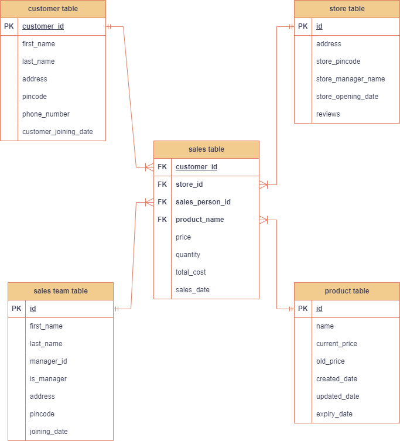

# End-to-End Business Data Analysi

## Overview

Welcome to the project! This endeavor aims to provide insights into the functioning of projects within a real-time environment. The code has been meticulously crafted to nurture your coding skills and impart a comprehensive understanding of project structures.

## Requirements

- Laptop with minimum 4 GB of RAM, i3 processor or above (8GB with i5 recommended).
- Local setup of Spark. This setup can be tricky, so ensure all configurations are correct.
- Python 3.10.11 installed.
- PyCharm installed.
- MySQL Workbench installed.
- GitHub account (optional but recommended).
- AWS account.
- Understanding of Spark, SQL, and Python.

## Project Structure

```plaintext
my_project/
├── docs/
│   └── readme.md
├── resources/
│   ├── __init__.py
│   ├── dev/
│   │    ├── config.py
│   │    └── requirement.txt
│   └── qa/
│   │    ├── config.py
│   │    └── requirement.txt
│   └── prod/
│   │    ├── config.py
│   │    └── requirement.txt
│   ├── sql_scripts/
│   │    └── table_scripts.sql
├── src/
│   ├── main/
│   │    ├── __init__.py
│   │    └── delete/
│   │    │      ├── aws_delete.py
│   │    │      ├── database_delete.py
│   │    │      └── local_file_delete.py
│   │    └── download/
│   │    │      └── aws_file_download.py
│   │    └── move/
│   │    │      └── move_files.py
│   │    └── read/
│   │    │      ├── aws_read.py
│   │    │      └── database_read.py
│   │    └── transformations/
│   │    │      └── jobs/
│   │    │      │     ├── customer_mart_sql_transform_write.py
│   │    │      │     ├── dimension_tables_join.py
│   │    │      │     ├── main.py
│   │    │      │     └── sales_mart_sql_transform_write.py
│   │    └── upload/
│   │    │      └── upload_to_s3.py
│   │    └── utility/
│   │    │      ├── encrypt_decrypt.py
│   │    │      ├── logging_config.py
│   │    │      ├── s3_client_object.py
│   │    │      ├── spark_session.py
│   │    │      └── my_sql_session.py
│   │    └── write/
│   │    │      ├── database_write.py
│   │    │      └── parquet_write.py
│   ├── test/
│   │    ├── scratch_pad.py
│   │    └── generate_csv_data.py


How to Run the Program in PyCharm

Open PyCharm Editor:

Launch PyCharm on your system.
Upload or Pull the Project from GitHub:

Clone the repository from GitHub to your local machine.
Open Terminal from the Bottom Pane:

Navigate to the terminal section within PyCharm.
Activate the Virtual Environment:

Navigate to your virtual environment directory and activate it.
cd venv/Scripts
activate
If activate doesn't work, use ./activate.
Create main.py:

Follow the instructions provided in the YouTube channel videos to create main.py.
AWS Setup:

Create a user on AWS with full S3 access and provide the secret key and access key in the config file.
Run main.py:

Use the green play button on the top right-hand side in PyCharm to run main.py.
Troubleshooting:

If everything works as expected, enjoy. Otherwise, re-check the configurations and retry.

Project Architecture

Database ER Diagram

